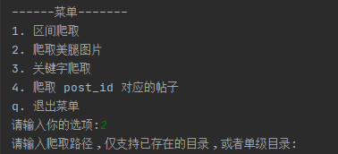

# 爬取葫芦侠小姐姐 图片

使用  python3.7 环境
拥有多线程优化速度


接口直接 fidder 抓包获取 
每个帖子对应一个 postid 

编程改变世界


## _key 获取

帐号登陆验证， 然后 fidder 抓包获取

## 功能简介

### 区间爬取


```text
输入:
1-100 

爬取 postid 1-100 的帖子
```

### 爬取美腿图片


```text
自动爬取 美腿图片，可以选择目录，也可以选择一个不存在的单级目录，不选目录，则有序存放
```


### 关键字爬取

> 需要一个已经登陆过的帐号，才能进行搜索操作 
> 服务器验证 _key  


### post_id 爬取
爬取单个 帖子的数据


## 效果图


## 爬取数据

> 如果有视频，则抓取视频
> 
> js.txt 为 获取到的 数据的 json 格式
> 
> 说明.txt 为 帖子的内容(不带评论)

> img 目录是一个例子
> video 目录是一个爬取到的视频


## 优化日志
2021.4.14:  准备删掉多线程 ， 使用更快的异步并发来实现图片抓取
2021.4.26:  异步计划泡汤，现在想整成 flask 框架， 网页浏览图片， 美滋滋, 新增获取 图片 地址
